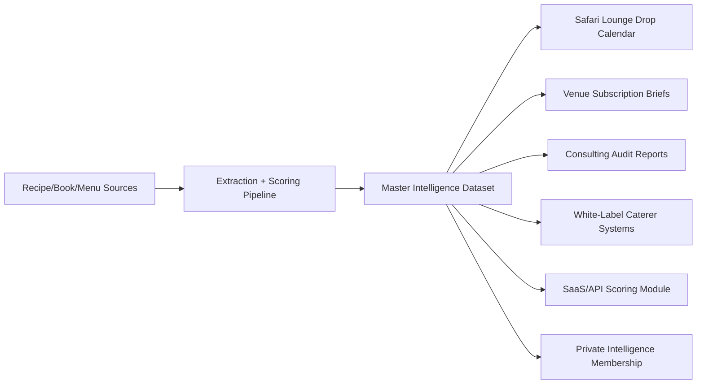

# One Backend Intelligence Layer Feeding Multiple Brands And Clients

## Architecture

## Data Contract

| Field | Use |
|---|---|
| `recipe_id` | filter, score, rank, personalize, or package offers |
| `recipe_title` | filter, score, rank, personalize, or package offers |
| `dish_category` | filter, score, rank, personalize, or package offers |
| `cuisine_family` | filter, score, rank, personalize, or package offers |
| `commercial_deployability_score` | filter, score, rank, personalize, or package offers |
| `consumer_craving_score` | filter, score, rank, personalize, or package offers |
| `scarcity_drop_potential` | filter, score, rank, personalize, or package offers |
| `productization_potential` | filter, score, rank, personalize, or package offers |
| `safari_lounge_fit` | filter, score, rank, personalize, or package offers |
| `ghost_kitchen_fit` | filter, score, rank, personalize, or package offers |
| `catering_fit` | filter, score, rank, personalize, or package offers |
| `consulting_value_fit` | filter, score, rank, personalize, or package offers |
| `saas_dataset_fit` | filter, score, rank, personalize, or package offers |

## Multi-Brand Outputs

| Brand/client | Same backend data becomes | Recurring rent mechanism |
|---|---|---|
| Safari Lounge | limited mainstream-fusion drops | weekly allocation calendar |
| Caterer | office/family tray systems | monthly menu dependency subscription |
| Restaurant | menu leak and hidden winner audits | quarterly re-audit |
| Consultant | white-label intelligence packs | license fee |
| SaaS | deployability and craving scores | API/data subscription |

## Current Dataset Mix

- catering tray / office bundle: 44
- ghost kitchen menu item: 17
- bottled sauce / rub / dry mix: 4